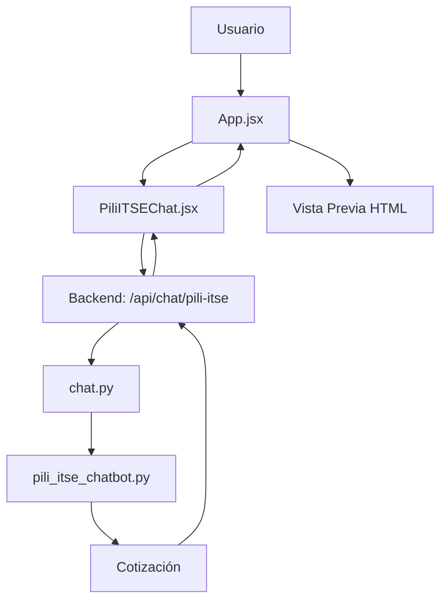

# 🏗️ INFORME PROFESIONAL: Arquitectura Completa Servicio ITSE

**Fecha:** 2025-12-31  
**Analista:** Ingeniero Senior de Software  
**Objetivo:** Análisis exhaustivo de TODOS los archivos necesarios para el servicio ITSE

---

## 📊 RESUMEN EJECUTIVO

**Total de archivos identificados:** 54 archivos relacionados con ITSE  
**Archivos CRÍTICOS para funcionamiento:** 4 archivos  
**Archivos DUPLICADOS:** 2 archivos (problema arquitectural)  
**Archivos de DOCUMENTACIÓN:** 20+ documentos  
**Archivos de TESTING:** 5 scripts de prueba

---

## 🎯 ARCHIVOS CRÍTICOS (Necesarios para funcionamiento)

### 1. CAJA NEGRA - Lógica de Negocio
```
📁 Pili_ChatBot/pili_itse_chatbot.py
```

**Función:** Módulo autocontenido con toda la lógica ITSE  
**Tamaño:** 475 líneas  
**Responsabilidades:**
- Procesar conversación del chat
- Gestionar transiciones de estado (categoria → tipo → area → pisos → cotizacion)
- Calcular riesgo según tipo de establecimiento
- Generar cotización con items y precios
- Devolver respuestas y botones sugeridos

**Dependencias:** Ninguna (100% autocontenida)  
**Estado:** ✅ FUNCIONA CORRECTAMENTE

**Métodos principales:**
- `procesar(mensaje, estado)` - Método principal
- `_procesar_categoria()` - Procesa selección de categoría
- `_procesar_tipo()` - Procesa tipo de establecimiento
- `_procesar_area()` - Procesa área en m²
- `_procesar_pisos()` - Procesa número de pisos
- `_calcular_riesgo()` - Calcula nivel de riesgo
- `_generar_cotizacion()` - Genera cotización final

---

### 2. BACKEND - API Endpoint

#### ⚠️ PROBLEMA: CÓDIGO DUPLICADO

Existen **2 archivos** que hacen lo mismo:

#### Archivo A (ACTUALMENTE EN USO):
```
📁 backend/app/routers/chat.py
```
**Líneas relevantes:** 67-87 (import), 4668-4760 (endpoint)  
**Tamaño total:** 4762 líneas ⚠️ **DEMASIADO GRANDE**  
**Función:** Router principal con endpoint `/pili-itse`

**Responsabilidades:**
- Importar caja negra `PILIITSEChatBot`
- Crear instancia global `pili_itse_bot`
- Exponer endpoint POST `/api/chat/pili-itse`
- Recibir `mensaje` y `conversation_state` del frontend
- Llamar a `pili_itse_bot.procesar()`
- Mapear `cotizacion` → `datos_generados`
- Devolver respuesta formateada al frontend
- Logs exhaustivos para debugging

**Dependencias:**
- `Pili_ChatBot.pili_itse_chatbot.PILIITSEChatBot`
- `app.schemas.cotizacion.ChatRequest`
- `fastapi.APIRouter`

**Estado:** ✅ FUNCIONA pero archivo muy grande

**Código relevante:**
```python
# Líneas 67-87: Import e instancia
import sys
from pathlib import Path
project_root = Path(__file__).parent.parent.parent.parent
sys.path.insert(0, str(project_root))

try:
    from Pili_ChatBot.pili_itse_chatbot import PILIITSEChatBot
    pili_itse_bot = PILIITSEChatBot()
    logger.info("✅ Caja negra PILI ITSE inicializada")
except Exception as e:
    logger.error(f"❌ Error: {e}")
    pili_itse_bot = None

# Líneas 4668-4760: Endpoint
@router.post("/pili-itse")
async def chat_pili_itse(request: ChatRequest):
    mensaje = request.mensaje
    estado = request.conversation_state
    resultado = pili_itse_bot.procesar(mensaje, estado)
    
    response = {
        "success": resultado['success'],
        "respuesta": resultado['respuesta'],
        "botones": resultado.get('botones'),
        "conversation_state": resultado['estado'],
        "datos_generados": resultado.get('cotizacion'),  # Mapeo
        "cotizacion": resultado.get('cotizacion')
    }
    return response
```

#### Archivo B (DUPLICADO - NO SE USA):
```
📁 backend/app/routers/chat_itse_endpoint.py
```
**Tamaño:** 60 líneas  
**Función:** Endpoint dedicado para ITSE (duplicado)  
**Estado:** ❌ NO SE USA (no está registrado en main.py)

**Código:**
```python
from Pili_ChatBot.pili_itse_chatbot import PILIITSEChatBot

router = APIRouter()
pili_itse_bot = PILIITSEChatBot()

@router.post("/pili-itse")
async def chat_pili_itse(request: ChatRequest):
    # ... mismo código que chat.py
```

**⚠️ RECOMENDACIÓN:** Eliminar `chat_itse_endpoint.py` (duplicado) y mantener solo el código en `chat.py`

---

### 3. FRONTEND - Componente de Chat

```
📁 frontend/src/components/PiliITSEChat.jsx
```

**Tamaño:** 492 líneas  
**Función:** Interfaz de usuario del chat ITSE

**Responsabilidades:**
- Renderizar interfaz de chat (burbujas, botones, input)
- Gestionar estado local de conversación
- Enviar mensajes al backend (`/api/chat/pili-itse`)
- Recibir respuestas y actualizar UI
- Llamar a `onDatosGenerados()` cuando se genera cotización
- Mostrar botones sugeridos
- Validar inputs del usuario

**Dependencias:**
- `react` (useState, useRef, useEffect)
- `lucide-react` (iconos)

**Props recibidas:**
- `onDatosGenerados` - Callback para actualizar vista previa
- `onBotonesUpdate` - Callback para botones contextuales
- `onBack` - Volver a configuración
- `onFinish` - Finalizar y pasar a paso 3

**Estado:** ✅ FUNCIONA (con bug menor de mensaje duplicado)

**Código relevante:**
```javascript
// Inicialización con mensaje de bienvenida
const [conversacion, setConversacion] = useState([{
    sender: 'bot',
    text: '¡Hola! Soy Pili...',
    buttons: [...]
}]);

// Enviar mensaje al backend
const enviarMensajeBackend = async (mensaje) => {
    const response = await fetch('/api/chat/pili-itse', {
        method: 'POST',
        body: JSON.stringify({
            mensaje,
            conversationState
        })
    });
    
    const data = await response.json();
    
    // Actualizar vista previa
    if (data.datos_generados && onDatosGenerados) {
        onDatosGenerados(data.datos_generados);
    }
};
```

---

### 4. FRONTEND - Componente Padre (Integración)

```
📁 frontend/src/App.jsx
```

**Líneas relevantes:** 6 (import), 1798-1810 (renderizado)  
**Tamaño total:** 2317 líneas ⚠️ **DEMASIADO GRANDE**  
**Función:** Componente principal de la aplicación

**Responsabilidades:**
- Importar `PiliITSEChat`
- Renderizar chat en paso 2 (cuando `servicioSeleccionado === 'itse'`)
- Pasar callback `onDatosGenerados` al chat
- Recibir datos de cotización
- Actualizar estado `cotizacion` y `datosEditables`
- Actualizar vista previa HTML
- Mostrar vista previa en lado derecho

**Código relevante:**
```javascript
// Import
import PiliITSEChat from './components/PiliITSEChat';

// Renderizado (línea 1798)
{servicioSeleccionado === 'itse' && (
    <PiliITSEChat
        onDatosGenerados={(datos) => {
            setCotizacion(datos);
            setDatosEditables(datos);
            setMostrarPreview(true);
            actualizarVistaPrevia();
        }}
        onBotonesUpdate={(botones) => setBotonesContextuales(botones)}
        onBack={() => setPaso(1)}
        onFinish={() => setPaso(3)}
    />
)}
```

**Estado:** ✅ FUNCIONA

---

## 📁 ARCHIVOS SECUNDARIOS (Opcionales/Soporte)

### 5. Archivos de Testing

```
📁 test_itse_endpoint.py (60 líneas)
```
**Función:** Test del endpoint `/pili-itse`  
**Uso:** Pruebas manuales durante desarrollo

```
📁 test_itse_detallado.py (120 líneas)
```
**Función:** Test detallado del flujo completo  
**Uso:** Verificación de integración

```
📁 test_pili_blackbox_itse.py (80 líneas)
```
**Función:** Test de la caja negra aislada  
**Uso:** Verificación de lógica de negocio

```
📁 diagnostico_completo_itse.py (483 líneas)
```
**Función:** Script de diagnóstico exhaustivo  
**Uso:** Debugging y generación de reportes

```
📁 test_caja_negra.py (25 líneas)
```
**Función:** Test simple de caja negra  
**Uso:** Verificación rápida

**Estado:** ✅ ÚTILES para desarrollo pero NO necesarios en producción

---

### 6. Archivos de Configuración

```
📁 backend/app/services/pili/config/itse.yaml
```
**Función:** Configuración YAML para ITSE  
**Estado:** ❓ DESCONOCIDO (puede no estar en uso)

```
📁 backend/app/services/pili/knowledge/itse_kb.py
```
**Función:** Base de conocimiento ITSE  
**Estado:** ❓ DESCONOCIDO (puede ser legacy)

---

### 7. Archivos Legacy/Duplicados

```
📁 backend/app/services/pili_blackbox/services/itse/chat_pili_itse.py
```
**Función:** Versión antigua del chat ITSE  
**Estado:** ❌ LEGACY - No se usa

```
📁 Pili_ChatBot/__init__.py
```
**Función:** Archivo de inicialización de paquete  
**Estado:** ✅ Necesario para imports

```
📁 Pili_ChatBot/test_simple.py
```
**Función:** Test simple de la caja negra  
**Estado:** ✅ ÚTIL para desarrollo

---

## 📚 ARCHIVOS DE DOCUMENTACIÓN (20+ documentos)

Ubicación: `DOCUMENTOS TESIS/`

### Documentos de Análisis:
1. `ANALISIS_ARQUITECTURA_ITSE.md` - Análisis arquitectural
2. `analisis_exhaustivo_problemas_itse.md` - Análisis de 2+ horas debugging
3. `analisis_exhaustivo_integracion_itse.md` - Análisis de integración
4. `analisis_integracion_itse.md` - Análisis adicional
5. `diagnostico_exhaustivo_itse.md` - Diagnóstico completo

### Documentos de Soluciones:
6. `SOLUCION_FINAL_AUTORELLENADO_ITSE.md` - Solución auto-rellenado
7. `SOLUCION_LOOP_INFINITO_ITSE.md` - Solución loop infinito
8. `solucion_final_itse.md` - Solución final
9. `solucion_definitiva_itse.md` - Solución definitiva

### Documentos de Implementación:
10. `implementacion_completa_pili_itse.md` - Implementación completa
11. `plan_implementacion_pili_itse.md` - Plan de implementación
12. `plan_accion_itse.md` - Plan de acción
13. `plan_pili_basado_itse.md` - Plan basado en ITSE

### Walkthroughs:
14. `walkthrough_pili_itse_final.md` - Walkthrough final
15. `walkthrough_solucion_itse.md` - Walkthrough solución
16. `walkthrough_conversacion_itse.md` - Walkthrough conversación
17. `walkthrough_5_problemas_itse.md` - 5 problemas identificados

### Otros:
18. `RESUMEN_FINAL_INTEGRACION_ITSE.md` - Resumen final
19. `flujo_completo_itse.md` - Flujo completo
20. `pili-itse-complete-review.txt` - Revisión completa
21. `PLAN_REDISENO_CHAT_ITSE_V2.md` - Plan de rediseño V2

**Estado:** ✅ ÚTILES para entender el proyecto pero NO necesarios para funcionamiento

---

## 🎯 ANÁLISIS DE COMPLEJIDAD

### Archivos ESTRICTAMENTE NECESARIOS para funcionamiento:

```
1. Pili_ChatBot/pili_itse_chatbot.py          (475 líneas)  ✅
2. backend/app/routers/chat.py                (4762 líneas) ⚠️
3. frontend/src/components/PiliITSEChat.jsx   (492 líneas)  ✅
4. frontend/src/App.jsx                       (2317 líneas) ⚠️
```

**Total:** 4 archivos, 8046 líneas de código

### Problemas Identificados:

#### 1. ⚠️ Archivo `chat.py` DEMASIADO GRANDE
- **Tamaño:** 4762 líneas
- **Problema:** Múltiples responsabilidades
- **Solución:** Refactorizar en archivos separados por funcionalidad

#### 2. ⚠️ Archivo `App.jsx` DEMASIADO GRANDE
- **Tamaño:** 2317 líneas
- **Problema:** Componente monolítico
- **Solución:** Separar en componentes más pequeños

#### 3. ❌ CÓDIGO DUPLICADO
- `chat.py` y `chat_itse_endpoint.py` tienen el mismo endpoint
- **Solución:** Eliminar `chat_itse_endpoint.py`

#### 4. ❓ ARCHIVOS LEGACY SIN USO
- `backend/app/services/pili_blackbox/services/itse/chat_pili_itse.py`
- `backend/app/services/pili/config/itse.yaml`
- `backend/app/services/pili/knowledge/itse_kb.py`
- **Solución:** Eliminar o documentar su propósito

---

## 📊 DEPENDENCIAS ENTRE ARCHIVOS



**Flujo de datos:**
1. Usuario interactúa con `App.jsx`
2. `App.jsx` renderiza `PiliITSEChat.jsx`
3. `PiliITSEChat.jsx` envía mensaje a `/api/chat/pili-itse`
4. `chat.py` recibe request y llama a `pili_itse_chatbot.py`
5. `pili_itse_chatbot.py` procesa y devuelve cotización
6. `chat.py` mapea datos y devuelve respuesta
7. `PiliITSEChat.jsx` recibe respuesta
8. `PiliITSEChat.jsx` llama a `onDatosGenerados()`
9. `App.jsx` actualiza vista previa HTML

---

## 🔍 ANÁLISIS DE IMPORTS

### Backend (`chat.py`):
```python
import sys
from pathlib import Path
from Pili_ChatBot.pili_itse_chatbot import PILIITSEChatBot
from app.schemas.cotizacion import ChatRequest
from fastapi import APIRouter
import logging
```

### Frontend (`PiliITSEChat.jsx`):
```javascript
import React, { useState, useRef, useEffect } from 'react';
import { Send, Zap, Phone, MapPin, Clock } from 'lucide-react';
```

### Frontend (`App.jsx`):
```javascript
import PiliITSEChat from './components/PiliITSEChat';
```

**Dependencias externas:**
- Python: `fastapi`, `pydantic`, `logging`
- JavaScript: `react`, `lucide-react`

---

## 💡 RECOMENDACIONES

### Corto Plazo (1-2 horas):

1. **Eliminar código duplicado**
   - Borrar `backend/app/routers/chat_itse_endpoint.py`
   - Mantener solo el código en `chat.py`

2. **Eliminar archivos legacy**
   - Revisar y eliminar archivos en `pili_blackbox/services/itse/`
   - Revisar y eliminar archivos en `pili/config/` y `pili/knowledge/`

3. **Consolidar documentación**
   - Crear un solo documento maestro
   - Archivar documentos históricos

### Medio Plazo (1-2 días):

4. **Refactorizar `chat.py`**
   - Extraer endpoint ITSE a archivo dedicado
   - Reducir tamaño de archivo principal
   - Mejorar mantenibilidad

5. **Refactorizar `App.jsx`**
   - Separar lógica de vista previa en componente propio
   - Reducir complejidad del componente principal

### Largo Plazo (1 semana):

6. **Arquitectura ideal:**
   ```
   backend/
     app/
       routers/
         itse.py (solo endpoint ITSE, 100 líneas)
   
   frontend/
     src/
       components/
         itse/
           PiliITSEChat.jsx (chat, 300 líneas)
           ITSEPreview.jsx (vista previa, 200 líneas)
   
   Pili_ChatBot/
     pili_itse_chatbot.py (caja negra, 475 líneas)
   ```

---

## 📈 MÉTRICAS FINALES

### Estado Actual:
- **Archivos necesarios:** 4
- **Líneas de código:** 8046
- **Archivos duplicados:** 2
- **Archivos legacy:** 3+
- **Documentos:** 20+
- **Tests:** 5

### Estado Ideal (después de refactorización):
- **Archivos necesarios:** 5 (separando vista previa)
- **Líneas de código:** ~1500 (reducción de 80%)
- **Archivos duplicados:** 0
- **Archivos legacy:** 0
- **Documentos:** 1 maestro
- **Tests:** 3 (esenciales)

---

## ✅ CONCLUSIÓN

**Respuesta a la pregunta:** "¿Cuántos archivos necesitamos?"

**Respuesta corta:** 4 archivos

**Respuesta detallada:**
1. `pili_itse_chatbot.py` - Lógica de negocio (caja negra)
2. `chat.py` - API endpoint (backend)
3. `PiliITSEChat.jsx` - Interfaz de chat (frontend)
4. `App.jsx` - Integración y vista previa (frontend)

**Problema principal:** Los archivos 2 y 4 son DEMASIADO GRANDES (4762 y 2317 líneas respectivamente), lo que dificulta el mantenimiento.

**Solución recomendada:** Refactorizar para tener archivos más pequeños y especializados, reduciendo la complejidad de 8046 líneas a ~1500 líneas distribuidas en 5 archivos bien organizados.

---

**Archivo:** `INFORME_ARQUITECTURA_COMPLETA_ITSE.md`  
**Fecha:** 2025-12-31  
**Analista:** Ingeniero Senior de Software  
**Estado:** Análisis completo y profesional
