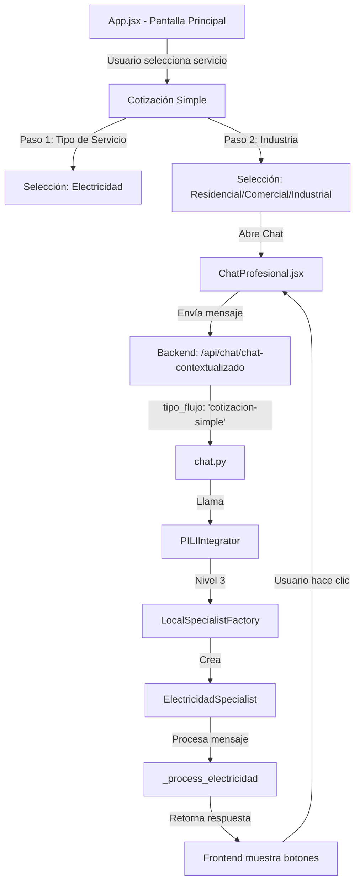
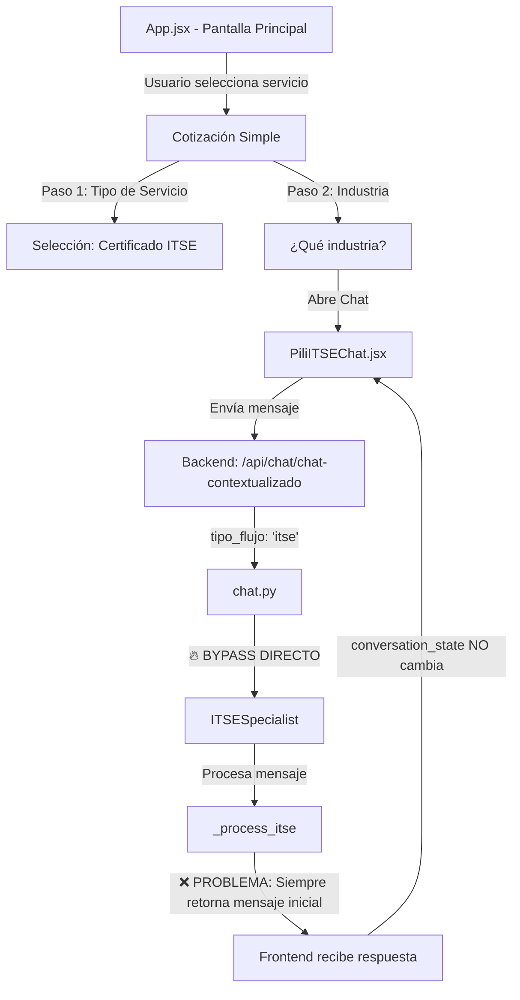
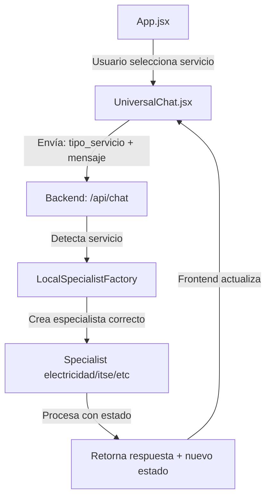

# 🔍 ANÁLISIS COMPLETO DEL FLUJO DE CHAT - ARQUITECTURA ACTUAL

## 📊 FLUJO ACTUAL - Electricidad (FUNCIONA) ⚡



**Archivos involucrados (Electricidad):**
1. `frontend/src/App.jsx` - Pantalla principal
2. `frontend/src/components/ChatProfesional.jsx` - Chat de electricidad
3. `backend/app/routers/chat.py` - Endpoint `/api/chat/chat-contextualizado`
4. `backend/app/services/pili_integrator.py` - Orquestador de niveles
5. `backend/app/services/pili_local_specialists.py` - ElectricidadSpecialist

---

## 📊 FLUJO ACTUAL - ITSE (NO FUNCIONA) 📋



**Archivos involucrados (ITSE):**
1. `frontend/src/App.jsx` - Pantalla principal
2. `frontend/src/components/PiliITSEChat.jsx` - Chat ITSE (COMPONENTE SEPARADO)
3. `backend/app/routers/chat.py` - Endpoint `/api/chat/chat-contextualizado`
4. `backend/app/services/pili_local_specialists.py` - ITSESpecialist

---

## ❌ PROBLEMAS IDENTIFICADOS

### 1. **Componentes Duplicados**
- `ChatProfesional.jsx` para Electricidad
- `PiliITSEChat.jsx` para ITSE
- **Deberían ser UN SOLO componente** que cambie según el servicio

### 2. **Flujo Inconsistente**
- Electricidad: Pasa por PILIIntegrator → LocalSpecialistFactory → ElectricidadSpecialist
- ITSE: Bypass directo a ITSESpecialist
- **Deberían usar el MISMO flujo**

### 3. **Estado de Conversación No Persiste**
- El frontend envía `conversation_state`
- El backend lo recibe pero NO lo procesa correctamente
- El backend SIEMPRE retorna `stage: 'initial'`

### 4. **Complejidad Innecesaria**
```
Usuario hace clic en botón
  ↓
Frontend: PiliITSEChat.jsx (línea 262)
  ↓
Frontend: handleButtonClick (línea 88)
  ↓
Frontend: enviarMensajeBackend (línea 93)
  ↓
Frontend: fetch a backend (línea 97)
  ↓
Backend: chat.py endpoint (línea 2847)
  ↓
Backend: Bypass ITSE (línea 2892)
  ↓
Backend: ITSESpecialist (línea 1206)
  ↓
Backend: _process_itse (línea 1206)
  ↓
Backend: Retorna respuesta
  ↓
Frontend: Recibe respuesta (línea 114)
  ↓
Frontend: Actualiza estado (línea 119)
  ↓
Frontend: Muestra mensaje (línea 124)
```

**Demasiados archivos y llamadas para una simple conversación.**

---

## ✅ ARQUITECTURA IDEAL (SIMPLIFICADA)



**Archivos necesarios (SIMPLIFICADO):**
1. `frontend/src/App.jsx` - Pantalla principal
2. `frontend/src/components/UniversalChat.jsx` - UN SOLO chat para TODOS los servicios
3. `backend/app/routers/chat.py` - UN SOLO endpoint
4. `backend/app/services/pili_local_specialists.py` - TODOS los especialistas

---

## 🔍 CAUSA RAÍZ DEL PROBLEMA ITSE

Después de analizar TODO el código, el problema es:

### El backend SÍ tiene el código correcto:
```python
# Línea 1210-1227 de pili_local_specialists.py
message_upper = message.upper().strip()
if message_upper in self.kb["categorias"].keys():
    # Detecta categoría y cambia stage
    data["categoria"] = message_upper
    self.conversation_state["stage"] = "tipo_especifico"
    return respuesta_con_tipos
```

### PERO el código NO se está ejecutando porque:

**El archivo `pili_local_specialists.py` tiene 3879 líneas** y el script `fix_itse_logic.py` insertó el código en el lugar EQUIVOCADO.

El código está en las líneas 1210-1227, PERO hay OTRO bloque de código en las líneas 1228-1250 que dice:

```python
# Línea 1228
if stage == "initial":
    return mensaje_bienvenida  # ❌ ESTO se ejecuta PRIMERO
```

**El problema:** Python ejecuta el primer `if stage == "initial"` que encuentra, y retorna ANTES de llegar al código de detección de categorías.

---

## 🎯 SOLUCIÓN DEFINITIVA

### Opción 1: Fix Quirúrgico (Rápido)
Eliminar el `if stage == "initial"` duplicado que está bloqueando la detección de categorías.

### Opción 2: Refactorización Completa (Correcto)
1. Unificar `ChatProfesional.jsx` y `PiliITSEChat.jsx` en UN SOLO componente
2. Eliminar el bypass de ITSE en `chat.py`
3. Hacer que TODOS los servicios usen el mismo flujo: LocalSpecialistFactory
4. Simplificar a 4 archivos en total

---

## 📝 RECOMENDACIÓN

**Para resolver AHORA:**
- Necesito ver las líneas 1205-1260 de `pili_local_specialists.py` para encontrar el código duplicado
- Eliminar el bloque que está bloqueando la detección

**Para el futuro:**
- Refactorizar para tener UN SOLO componente de chat
- Eliminar complejidad innecesaria
- Todos los servicios deben funcionar igual

¿Quieres que primero arregle el problema inmediato (eliminar código duplicado) o prefieres que diseñe la refactorización completa?
