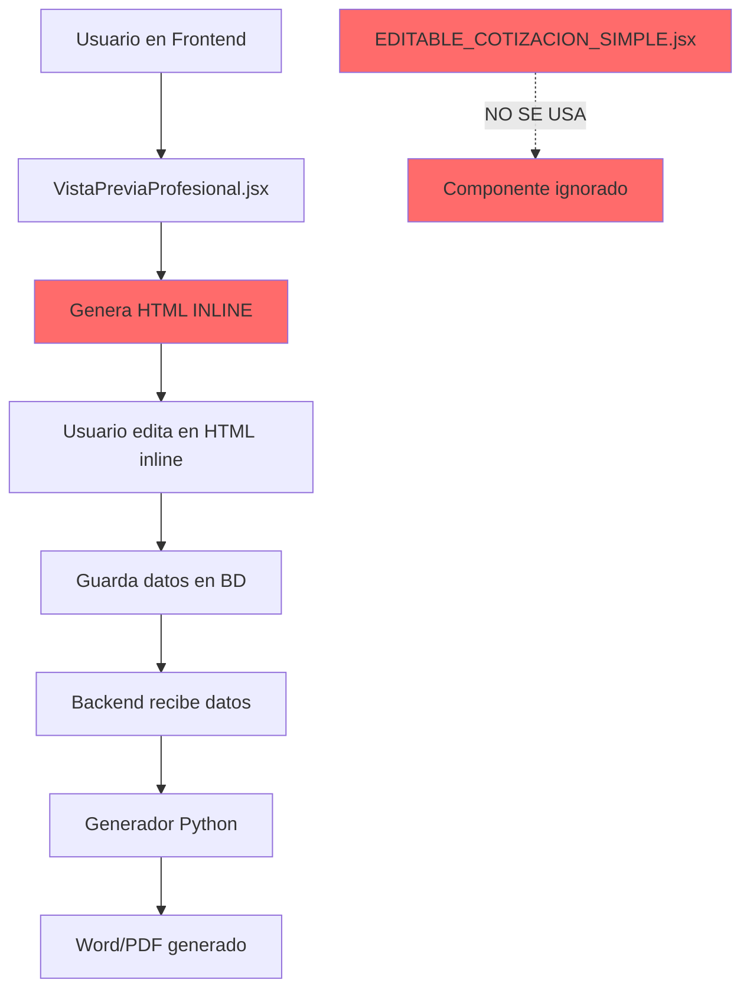
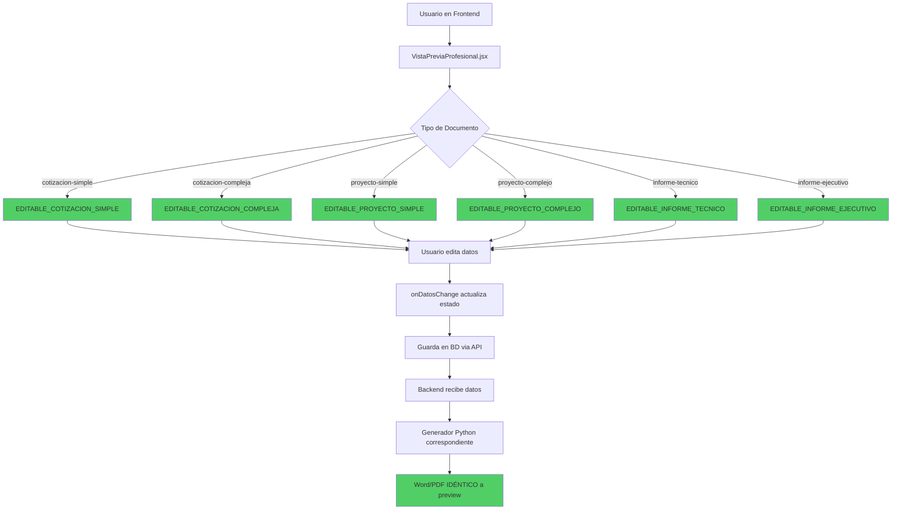

# 🚨 ANÁLISIS CRÍTICO: Flujo de Generación de Documentos

## ❌ PROBLEMA DETECTADO

**VistaPreviaProfesional NO está usando los componentes EDITABLE que creamos**

---

## 📊 FLUJO ACTUAL (INCORRECTO)



### ⚠️ Consecuencias del Flujo Actual:

1. **Vista Previa ≠ Documento Final**
   - `VistaPreviaProfesional` genera HTML diferente
   - `EDITABLE_COTIZACION_SIMPLE` tiene el HTML correcto
   - **Resultado**: Inconsistencia visual

2. **Datos Editables Diferentes**
   - Usuario edita en `VistaPreviaProfesional` (HTML inline)
   - Generador Python usa estructura de `EDITABLE_*`
   - **Resultado**: Posibles campos faltantes

3. **Mantenimiento Duplicado**
   - Cambios deben hacerse en 2 lugares
   - Fácil que se desincronicen
   - **Resultado**: Bugs y errores

---

## ✅ FLUJO CORRECTO (DEBE SER ASÍ)



### ✅ Ventajas del Flujo Correcto:

1. **Vista Previa = Documento Final** (100%)
2. **Una sola fuente de verdad** (componentes EDITABLE)
3. **Mantenimiento simplificado**
4. **Datos consistentes**

---

## 🔍 VERIFICACIÓN DEL CÓDIGO ACTUAL

### VistaPreviaProfesional.jsx (Líneas 1-100)

```javascript
const VistaPreviaProfesional = forwardRef((props) => {
  const {
    cotizacion,
    proyecto,
    informe,
    onGenerarDocumento,
    tipoDocumento = 'cotizacion',
    htmlPreview = '',
    esquemaColores = 'azul-tesla',
    logoBase64 = null,
    fuenteDocumento = 'Calibri'
  } = props;

  // ❌ PROBLEMA: Genera HTML inline, NO usa componentes EDITABLE
  const [cotizacionEditable, setCotizacionEditable] = useState(
    cotizacion || proyecto || informe || {}
  );
  
  // ... más código que genera HTML manualmente
});
```

**Problema**: El componente genera HTML inline en lugar de usar los componentes EDITABLE que creamos.

---

## 🛠️ SOLUCIÓN REQUERIDA

### Modificar VistaPreviaProfesional.jsx

```javascript
import React, { useState, useRef, forwardRef, useImperativeHandle } from 'react';
import { Eye, EyeOff, Download, FileText, Edit, Save } from 'lucide-react';

// ✅ IMPORTAR TODOS LOS COMPONENTES EDITABLE
import EDITABLE_COTIZACION_SIMPLE from './EDITABLE_COTIZACION_SIMPLE';
import EDITABLE_COTIZACION_COMPLEJA from './EDITABLE_COTIZACION_COMPLEJA';
import EDITABLE_PROYECTO_SIMPLE from './EDITABLE_PROYECTO_SIMPLE';
import EDITABLE_PROYECTO_COMPLEJO from './EDITABLE_PROYECTO_COMPLEJO';
import EDITABLE_INFORME_TECNICO from './EDITABLE_INFORME_TECNICO';
import EDITABLE_INFORME_EJECUTIVO from './EDITABLE_INFORME_EJECUTIVO';

const VistaPreviaProfesional = forwardRef((props) => {
  const {
    cotizacion,
    proyecto,
    informe,
    onGenerarDocumento,
    tipoDocumento = 'cotizacion',
    esquemaColores = 'azul-tesla',
    logoBase64 = null,
    fuenteDocumento = 'Calibri'
  } = props;

  // Estado para datos editables
  const [datosEditables, setDatosEditables] = useState(
    cotizacion || proyecto || informe || {}
  );

  // Callback cuando cambian los datos
  const handleDatosChange = (nuevosDatos) => {
    setDatosEditables(nuevosDatos);
    // Aquí puedes guardar en BD si es necesario
  };

  // ✅ RENDERIZAR COMPONENTE CORRECTO SEGÚN TIPO
  const renderDocumento = () => {
    const componentProps = {
      datos: datosEditables,
      esquemaColores,
      logoBase64,
      fuenteDocumento,
      onDatosChange: handleDatosChange
    };

    switch(tipoDocumento) {
      case 'cotizacion-simple':
      case 'cotizacion':
        return <EDITABLE_COTIZACION_SIMPLE {...componentProps} />;
      
      case 'cotizacion-compleja':
        return <EDITABLE_COTIZACION_COMPLEJA {...componentProps} />;
      
      case 'proyecto-simple':
      case 'proyecto':
        return <EDITABLE_PROYECTO_SIMPLE {...componentProps} />;
      
      case 'proyecto-complejo':
        return <EDITABLE_PROYECTO_COMPLEJO {...componentProps} />;
      
      case 'informe-tecnico':
      case 'informe':
        return <EDITABLE_INFORME_TECNICO {...componentProps} />;
      
      case 'informe-ejecutivo':
        return <EDITABLE_INFORME_EJECUTIVO {...componentProps} />;
      
      default:
        return <div>Tipo de documento no soportado</div>;
    }
  };

  return (
    <div className="vista-previa-profesional">
      {/* Panel de control (si es necesario) */}
      <div className="panel-control">
        {/* Botones de descarga, etc */}
      </div>

      {/* ✅ RENDERIZAR COMPONENTE EDITABLE */}
      <div className="documento-preview">
        {renderDocumento()}
      </div>
    </div>
  );
});

export default VistaPreviaProfesional;
```

---

## 📋 FLUJO DE DATOS CORRECTO

### 1. Frontend (React)

```javascript
// App.jsx o componente principal
<VistaPreviaProfesional
  tipoDocumento="cotizacion-simple"
  cotizacion={datosIniciales}
  esquemaColores="azul-tesla"
  logoBase64={logoEmpresa}
  fuenteDocumento="Calibri"
/>

// VistaPreviaProfesional.jsx
// Renderiza: <EDITABLE_COTIZACION_SIMPLE />

// EDITABLE_COTIZACION_SIMPLE.jsx
// Usuario edita → onDatosChange() → actualiza estado
```

### 2. Guardar en Base de Datos

```javascript
// Cuando usuario hace clic en "Guardar"
const guardarCotizacion = async () => {
  const response = await fetch('/api/cotizaciones', {
    method: 'POST',
    headers: { 'Content-Type': 'application/json' },
    body: JSON.stringify({
      tipo_documento: 'cotizacion-simple',
      datos: datosEditables,  // Datos del componente EDITABLE
      esquema_colores: 'azul-tesla',
      logo_base64: logoBase64,
      fuente: 'Calibri'
    })
  });
  
  const { id } = await response.json();
  return id;
};
```

### 3. Backend (Python)

```python
# routers/cotizaciones.py
@router.post("/cotizaciones")
async def crear_cotizacion(request: CotizacionCreate):
    # Guardar en BD
    cotizacion = Cotizacion(
        tipo_documento=request.tipo_documento,
        datos=request.datos,
        esquema_colores=request.esquema_colores,
        logo_base64=request.logo_base64,
        fuente=request.fuente
    )
    db.add(cotizacion)
    db.commit()
    return {"id": cotizacion.id}
```

### 4. Generar Documento

```python
# routers/generar_directo.py
@router.post("/generar/{cotizacion_id}")
async def generar_documento_desde_bd(cotizacion_id: int):
    # Obtener datos de BD
    cotizacion = db.query(Cotizacion).filter_by(id=cotizacion_id).first()
    
    # Generar Word
    from generators import generar_documento
    ruta_word = f"temp/cotizacion_{cotizacion_id}.docx"
    
    opciones = {
        'esquema_colores': cotizacion.esquema_colores,
        'logo_base64': cotizacion.logo_base64,
        'fuente': cotizacion.fuente
    }
    
    generar_documento(
        tipo_documento='cotizacion-simple',
        datos=cotizacion.datos,  # Mismos datos que en React
        ruta_salida=ruta_word,
        opciones=opciones
    )
    
    # Convertir a PDF si es necesario
    from generators.pdf_converter import convertir_word_a_pdf
    ruta_pdf = convertir_word_a_pdf(ruta_word)
    
    return FileResponse(ruta_word)
```

---

## ✅ RESULTADO ESPERADO

Con el flujo correcto:

```
┌─────────────────────────────────────────┐
│ Usuario edita en EDITABLE_COTIZACION   │
│ ↓                                       │
│ Datos guardados en BD                   │
│ ↓                                       │
│ Backend genera Word con mismo datos     │
│ ↓                                       │
│ Word → PDF                              │
│ ↓                                       │
│ TODOS SON IDÉNTICOS ✅                  │
└─────────────────────────────────────────┘
```

### Garantía:
- ✅ Vista Previa React = Word = PDF
- ✅ 100% fidelidad visual
- ✅ Datos consistentes
- ✅ Mantenimiento simple

---

## 🚨 ACCIÓN REQUERIDA

### Prioridad ALTA

1. **Modificar VistaPreviaProfesional.jsx**
   - Importar los 6 componentes EDITABLE
   - Implementar switch/case para renderizar correcto
   - Eliminar generación de HTML inline

2. **Verificar flujo de datos**
   - Asegurar que `onDatosChange` actualiza estado
   - Guardar en BD con estructura correcta
   - Backend lee misma estructura

3. **Testing**
   - Editar en React → Verificar preview
   - Generar Word → Comparar visualmente
   - Generar PDF → Verificar idéntico

---

## 📝 RESUMEN

### ❌ Problema Actual:
- `VistaPreviaProfesional` genera HTML inline
- NO usa componentes `EDITABLE_*`
- Preview ≠ Word ≠ PDF

### ✅ Solución:
- Integrar componentes `EDITABLE_*` en `VistaPreviaProfesional`
- Usar switch/case según `tipoDocumento`
- Garantizar: **Preview = Word = PDF**

---

**Preparado por**: Antigravity AI  
**Fecha**: 2025-12-23  
**Prioridad**: 🔴 CRÍTICA  
**Estado**: ⚠️ REQUIERE ACCIÓN INMEDIATA
