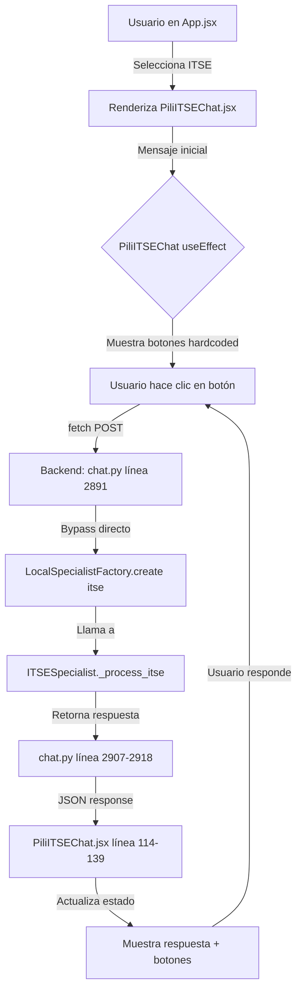
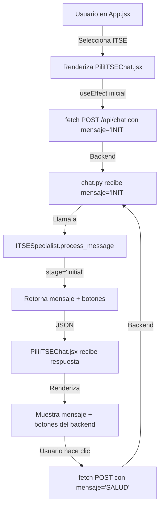

# 🔍 ANÁLISIS DE FLUJO Y RESPONSABILIDADES - CHAT ITSE

## 🎯 ARCHIVOS ANALIZADOS

1. **Frontend:** `App.jsx` (2,317 líneas)
2. **Frontend:** `PiliITSEChat.jsx` (483 líneas)
3. **Backend:** `chat.py` (4,636 líneas)
4. **Backend:** `pili_local_specialists.py` (3,881 líneas)

---

## 📊 FLUJO ACTUAL



---

## ⚠️ PROBLEMAS IDENTIFICADOS

### 1. **DUPLICIDAD DE MENSAJES INICIALES**

#### Frontend: `PiliITSEChat.jsx` (líneas 37-57)
```javascript
addBotMessage(
    `¡Hola! 👋 Soy **Pili**, tu especialista en certificados ITSE...
    
    **Selecciona tu tipo de establecimiento:**`,
    [
        { text: '🏥 Salud', value: 'SALUD' },
        { text: '🎓 Educación', value: 'EDUCACION' },
        // ... 8 botones
    ]
);
```

#### Backend: `pili_local_specialists.py` (líneas 1229-1253)
```python
if stage == "initial":
    return {
        "texto": """¡Hola! 👋 Soy **PILI**, especialista en certificados ITSE...
        
        **Selecciona tu tipo de establecimiento:**""",
        "botones": [
            {"text": "🏥 Salud", "value": "SALUD"},
            {"text": "🎓 Educación", "value": "EDUCACION"},
            // ... 8 botones
        ]
    }
```

**PROBLEMA:** El mismo mensaje y botones están definidos en 2 lugares.

**IMPACTO:** Si cambias el mensaje en el backend, el frontend sigue mostrando el viejo.

---

### 2. **BYPASS DIRECTO EN chat.py**

#### `chat.py` (líneas 2891-2924)
```python
# 🔥 BYPASS DIRECTO PARA ITSE - Llamar directamente a ITSESpecialist
if tipo_flujo == 'itse':
    try:
        from app.services.pili_local_specialists import LocalSpecialistFactory
        
        specialist = LocalSpecialistFactory.create('itse')
        response = specialist.process_message(mensaje, conversation_state)
        
        return {
            "success": True,
            "respuesta": response.get("texto", ""),
            "botones_sugeridos": response.get("botones", []),
            # ...
        }
    except Exception as e:
        logger.error(f"❌ Error en bypass ITSE: {e}")
        # Si falla el bypass, continuar con el flujo normal
```

**PROBLEMA:** Hay un bypass que salta todo el flujo normal de `pili_integrator`.

**IMPACTO:** 
- Si el bypass falla, cae en el flujo normal (líneas 2926-2996)
- Duplicidad de lógica de manejo de ITSE

---

### 3. **DOBLE FLUJO EN chat.py**

#### Flujo 1: Bypass ITSE (líneas 2891-2924)
```python
if tipo_flujo == 'itse':
    specialist = LocalSpecialistFactory.create('itse')
    response = specialist.process_message(mensaje, conversation_state)
    return response
```

#### Flujo 2: PILIIntegrator (líneas 2926-2996)
```python
resultado_pili = await pili_integrator.procesar_solicitud_completa(
    mensaje=mensaje,
    tipo_flujo=tipo_flujo,
    # ...
    servicio_forzado=servicio_forzado  # ✅ NUEVO: Forzar servicio ITSE
)
```

**PROBLEMA:** Dos caminos diferentes para llegar al mismo especialista.

**IMPACTO:** Confusión sobre cuál es el flujo correcto.

---

### 4. **ESTADO DE CONVERSACIÓN DUPLICADO**

#### Frontend: `PiliITSEChat.jsx` (línea 17)
```javascript
const [conversationState, setConversationState] = useState(null);
```

#### Backend: `pili_local_specialists.py` (línea 1207)
```python
stage = self.conversation_state["stage"]
data = self.conversation_state["data"]
```

**PROBLEMA:** El estado se mantiene en ambos lados.

**FLUJO:**
1. Frontend envía `conversation_state` al backend
2. Backend procesa y actualiza `self.conversation_state`
3. Backend retorna `state` al frontend
4. Frontend actualiza `conversationState`

**IMPACTO:** Si se desincroniza, el chat se rompe.

---

### 5. **RESPONSABILIDADES MEZCLADAS**

| Responsabilidad | ¿Dónde está? | ¿Debería estar? |
|-----------------|--------------|-----------------|
| Mensaje inicial | Frontend + Backend | ❌ Solo Backend |
| Botones iniciales | Frontend + Backend | ❌ Solo Backend |
| Estado de conversación | Frontend + Backend | ✅ Solo Backend |
| Renderizado de mensajes | Frontend | ✅ Frontend |
| Lógica de negocio | Backend | ✅ Backend |

---

## 🔥 DUPLICIDAD CRÍTICA

### Mensaje Inicial Hardcoded en Frontend

**`PiliITSEChat.jsx` líneas 36-57:**
```javascript
useEffect(() => {
    if (initialized.current) return;
    initialized.current = true;

    // Mensaje de bienvenida inicial
    addBotMessage(
        `¡Hola! 👋 Soy **Pili**...`,
        [
            { text: '🏥 Salud', value: 'SALUD' },
            // ... 8 botones
        ]
    );
}, []);
```

**PROBLEMA:** Este mensaje NUNCA pasa por el backend.

**CONSECUENCIA:** 
- Si cambias el mensaje en `pili_local_specialists.py`, el frontend NO lo refleja
- Los botones están hardcoded en el frontend
- El backend tiene el mismo mensaje pero NO se usa en el primer render

---

## 📋 FLUJO CORRECTO (Recomendado)



**VENTAJAS:**
- ✅ Un solo lugar para el mensaje inicial (backend)
- ✅ Un solo lugar para los botones (backend)
- ✅ Frontend solo renderiza, no tiene lógica de negocio
- ✅ Fácil de mantener

---

## 🎯 RECOMENDACIONES

### 1. **ELIMINAR Mensaje Inicial del Frontend**

**Cambiar `PiliITSEChat.jsx` líneas 32-58:**

**Antes:**
```javascript
useEffect(() => {
    if (initialized.current) return;
    initialized.current = true;

    // Mensaje de bienvenida inicial
    addBotMessage(
        `¡Hola! 👋 Soy **Pili**...`,
        [...]
    );
}, []);
```

**Después:**
```javascript
useEffect(() => {
    if (initialized.current) return;
    initialized.current = true;

    // Obtener mensaje inicial del backend
    enviarMensajeBackend('INIT');
}, []);
```

---

### 2. **ELIMINAR Bypass Directo en chat.py**

**Eliminar líneas 2891-2924 de `chat.py`:**

```python
# 🔥 BYPASS DIRECTO PARA ITSE - Llamar directamente a ITSESpecialist
if tipo_flujo == 'itse':
    # ... TODO ESTE BLOQUE
```

**Razón:** Ya existe el flujo con `pili_integrator` que hace lo mismo.

---

### 3. **SIMPLIFICAR Flujo a UN SOLO CAMINO**

**Flujo único:**
```
PiliITSEChat.jsx 
    → chat.py 
    → pili_integrator.procesar_solicitud_completa()
    → LocalSpecialistFactory.create('itse')
    → ITSESpecialist.process_message()
```

**Eliminar:**
- ❌ Bypass directo en chat.py
- ❌ Mensaje inicial en frontend
- ❌ Botones hardcoded en frontend

---

### 4. **CENTRALIZAR Estado en Backend**

**Frontend solo debe:**
- Enviar mensaje
- Recibir respuesta
- Renderizar

**Backend debe:**
- Mantener estado de conversación
- Generar mensajes
- Generar botones
- Aplicar lógica de negocio

---

## 📊 COMPARACIÓN

### Flujo Actual (Problemático)

```
Frontend (PiliITSEChat.jsx)
├── Mensaje inicial hardcoded ❌
├── Botones hardcoded ❌
├── Estado de conversación ⚠️
└── Renderizado ✅

Backend (chat.py)
├── Bypass directo ITSE ❌
├── Flujo PILIIntegrator ⚠️
└── Retorna respuesta ✅

Backend (pili_local_specialists.py)
├── Mensaje inicial (no usado) ❌
├── Botones (no usados en primer render) ❌
├── Lógica de negocio ✅
└── Estado de conversación ✅
```

### Flujo Recomendado (Limpio)

```
Frontend (PiliITSEChat.jsx)
├── Envía 'INIT' al backend ✅
├── Recibe mensaje + botones ✅
├── Renderiza ✅
└── Envía clicks de usuario ✅

Backend (chat.py)
├── Recibe mensaje ✅
├── Llama a pili_integrator ✅
└── Retorna respuesta ✅

Backend (pili_local_specialists.py)
├── Mensaje inicial ✅
├── Botones ✅
├── Lógica de negocio ✅
└── Estado de conversación ✅
```

---

## ✅ CONCLUSIÓN

**SÍ, estás duplicando responsabilidades:**

1. ❌ Mensaje inicial en frontend Y backend
2. ❌ Botones en frontend Y backend
3. ❌ Dos flujos diferentes en chat.py (bypass + integrator)
4. ❌ Estado en frontend Y backend

**Solución:**
- Frontend: Solo renderizar
- Backend: Toda la lógica

**Beneficios:**
- ✅ Un solo lugar para cambiar mensajes
- ✅ Un solo flujo de código
- ✅ Más fácil de mantener
- ✅ Menos bugs

¿Quieres que implemente estas simplificaciones?
