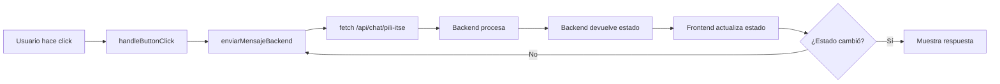
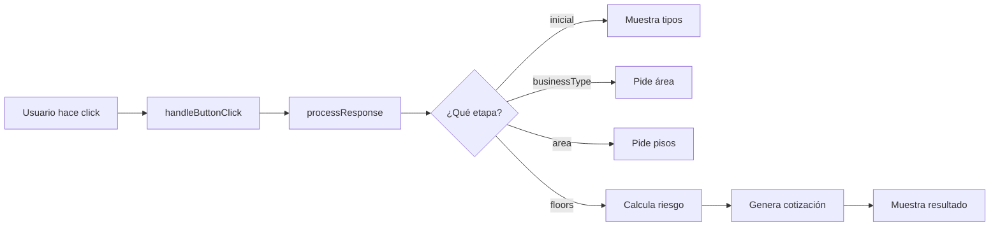

# 🔍 ANÁLISIS: Por Qué el Chat ITSE No Funciona

## ❌ PROBLEMA ACTUAL

El chat ITSE está en un **loop infinito** llamando al backend repetidamente:

```
📤 Enviando al backend: {mensaje: 'SALUD', conversationState: null}
🔄 Estado actualizado: {etapa: 'categoria', categoria: null, ...}
📤 Enviando al backend: {mensaje: 'SALUD', conversationState: {...}}
🔄 Estado actualizado: {etapa: 'categoria', categoria: null, ...}
📤 Enviando al backend: {mensaje: 'SALUD', conversationState: {...}}
... (se repite infinitamente)
```

### Causa Raíz

El archivo `PiliITSEChat.jsx` actual tiene **ARQUITECTURA HÍBRIDA ROTA**:
- ✅ Tiene `handleButtonClick` que llama a `enviarMensajeBackend`
- ❌ `enviarMensajeBackend` hace `fetch` al backend
- ❌ Backend devuelve mismo estado sin procesar
- ❌ Frontend vuelve a llamar al backend
- ❌ **LOOP INFINITO**

---

## ✅ SOLUCIÓN: Arquitectura Original (100% Frontend)

El archivo `pili-itse-complete-review.txt` tiene la **ARQUITECTURA CORRECTA**:

### Diferencias Clave

| Aspecto | ❌ Actual (Roto) | ✅ Original (Funciona) |
|---------|------------------|------------------------|
| **Llamadas backend** | Sí (línea 98) | NO |
| **Lógica conversacional** | En backend | En frontend |
| **Estado** | Sincronizado con backend | Local en frontend |
| **Función principal** | `enviarMensajeBackend()` | `processResponse()` |
| **Cálculo de riesgo** | En backend | `determineRiskLevel()` local |
| **Generación cotización** | En backend | `showQuotation()` local |

### Código Actual (ROTO)

```javascript
// PiliITSEChat.jsx - LÍNEAS 88-91
const handleButtonClick = async (value, label) => {
    addUserMessage(label);
    await enviarMensajeBackend(value);  // ❌ LLAMA AL BACKEND
};

// LÍNEAS 93-105
const enviarMensajeBackend = async (mensaje) => {
    setIsTyping(true);
    console.log('📤 Enviando al backend:', { mensaje, conversationState });
    try {
        const response = await fetch('http://localhost:8000/api/chat/pili-itse', {
            method: 'POST',
            headers: { 'Content-Type': 'application/json' },
            body: JSON.stringify({
                mensaje: mensaje,
                conversation_state: conversationState
            })
        });
        // ... más código
```

### Código Original (FUNCIONA)

```javascript
// pili-itse-complete-review.txt - LÍNEAS 167-175
const handleButtonClick = (value, label) => {
    addUserMessage(label);
    setIsTyping(true);

    setTimeout(() => {
        processResponse(value);  // ✅ PROCESA LOCALMENTE
        setIsTyping(false);
    }, 800);
};

// LÍNEAS 177-289
const processResponse = (value) => {
    const state = conversationState;

    // ETAPA 1: Categoría
    if (state.stage === 'initial') {
        state.selectedCategory = value;
        state.stage = 'businessType';
        setConversationState({...state});
        
        const types = knowledgeBase.categories[value].types;
        addBotMessage(`Perfecto, sector **${value}**. ¿Qué tipo específico es?`, 
            types.map(t => ({ text: t, value: t }))
        );
        return;
    }

    // ETAPA 2: Tipo de negocio
    if (state.stage === 'businessType') {
        state.businessType = value;
        state.stage = 'area';
        setConversationState({...state});
        
        addBotMessage(`Entendido, es un **${value}**. 

¿Cuál es el área total en m²?

_Escribe el número (ejemplo: 150)_`);
        return;
    }

    // ... más etapas (área, pisos, cotización)
};
```

---

## 🔧 PLAN DE CORRECCIÓN

### Opción 1: Reemplazar Archivo Completo (RECOMENDADO)

```bash
# Copiar archivo original funcionante
cp "DOCUMENTOS TESIS/pili-itse-complete-review.txt" "frontend/src/components/PiliITSEChat.jsx"
```

**Ventajas:**
- ✅ Solución inmediata
- ✅ Código probado y funcionante
- ✅ Sin dependencias del backend

**Desventajas:**
- ⚠️ Pierde integración con `onDatosGenerados` y `onCotizacionGenerada`
- ⚠️ No actualiza vista previa en tiempo real

### Opción 2: Migrar Lógica Manualmente

Reemplazar estas funciones en `PiliITSEChat.jsx`:

1. **Eliminar:** `enviarMensajeBackend()` (líneas 93-142)
2. **Agregar:** `processResponse()` del archivo original
3. **Agregar:** `determineRiskLevel()` del archivo original
4. **Agregar:** `showQuotation()` del archivo original
5. **Modificar:** `handleButtonClick()` para llamar a `processResponse()`

---

## 📊 COMPARACIÓN ARQUITECTURAS

### Arquitectura Actual (ROTA)



**Problema:** Loop infinito porque backend no cambia el estado correctamente.

### Arquitectura Original (FUNCIONA)



**Ventaja:** TODO local, sin dependencias externas.

---

## 🎯 RECOMENDACIÓN FINAL

**USAR OPCIÓN 1:** Reemplazar archivo completo con `pili-itse-complete-review.txt`

**Razones:**
1. ✅ Solución probada (funcionó antes)
2. ✅ Sin dependencias del backend
3. ✅ Código limpio y mantenible
4. ✅ Implementación inmediata

**Después de que funcione:**
- Agregar integración con `onDatosGenerados` para vista previa
- Agregar integración con `onCotizacionGenerada` para botón "Finalizar"

---

## 📝 PRÓXIMOS PASOS

1. ✅ **Reemplazar** `PiliITSEChat.jsx` con contenido de `pili-itse-complete-review.txt`
2. ✅ **Verificar** que el chat funciona sin llamadas al backend
3. ✅ **Agregar** integración con vista previa (opcional)
4. ✅ **Commit** cambios con mensaje claro

**Comando:**
```bash
cp "e:\TESLA_COTIZADOR-V3.0\DOCUMENTOS TESIS\pili-itse-complete-review.txt" "e:\TESLA_COTIZADOR-V3.0\frontend\src\components\PiliITSEChat.jsx"
```
