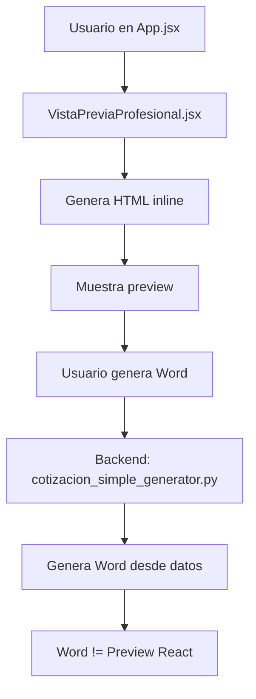
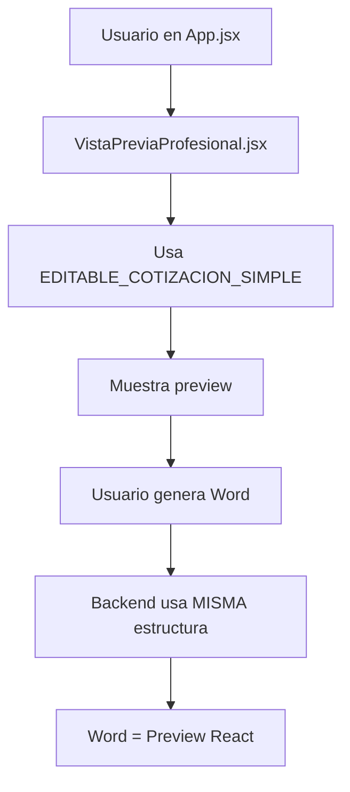

# 📊 ANÁLISIS PROFESIONAL: Las 2 Vistas Previas del Flujo

## 🎯 OBJETIVO
Analizar las **2 vistas previas** que existen en el flujo de documentos, tomando **COTIZACION_SIMPLE** como ejemplo de referencia.

---

## 🔍 LAS 2 VISTAS PREVIAS IDENTIFICADAS

### 1. VistaPrevia.jsx (Vista Básica Editable)
**Ubicación**: `frontend/src/components/VistaPrevia.jsx`
**Líneas**: 397
**Propósito**: Vista previa básica con edición inline

### 2. VistaPreviaProfesional.jsx (Vista Profesional con Diseño)
**Ubicación**: `frontend/src/components/VistaPreviaProfesional.jsx`
**Líneas**: 940
**Propósito**: Vista previa profesional con estilos HTML y personalización

---

## 📋 ANÁLISIS DETALLADO: VistaPrevia.jsx

### Características

```javascript
const VistaPrevia = forwardRef(({
  cotizacion,
  proyecto,
  informe,
  onGenerarDocumento,
  tipoDocumento = 'cotizacion',
  htmlPreview = ''
}, ref) => {
```

#### Props Recibidos:
- `cotizacion` / `proyecto` / `informe` - Datos del documento
- `tipoDocumento` - Tipo de documento
- `htmlPreview` - HTML pre-renderizado (opcional)
- `onGenerarDocumento` - Callback para generar Word/PDF

#### Estados:
```javascript
const [modoEdicion, setModoEdicion] = useState(true);
const [ocultarPreciosUnitarios, setOcultarPreciosUnitarios] = useState(false);
const [ocultarTotalesPorItem, setOcultarTotalesPorItem] = useState(false);
const [modoVisualizacionIGV, setModoVisualizacionIGV] = useState('sin-igv');
const [cotizacionEditable, setCotizacionEditable] = useState(cotizacion || proyecto || informe || {});
```

#### Funcionalidades:
1. ✅ **Modo Edición**: Toggle entre edición y vista final
2. ✅ **Ocultar Precios**: Oculta precios unitarios
3. ✅ **Ocultar Totales**: Oculta totales por item
4. ✅ **Visualización IGV**: Con/sin IGV
5. ✅ **Edición Inline**: Edita items directamente en tabla
6. ✅ **Cálculo Automático**: Recalcula totales

#### Panel de Control:
```javascript
// Panel de control - NO SE IMPRIME
<div className="no-print mb-6">
  <div className="bg-gradient-to-r from-yellow-900 to-yellow-800">
    <h3>{modoEdicion ? '✏️ MODO EDICIÓN' : '✅ VISTA FINAL'}</h3>
    // Botones de control
  </div>
</div>
```

### ⚠️ PROBLEMA IDENTIFICADO

**NO USA COMPONENTES EDITABLE_***

El componente genera el HTML **inline** en lugar de usar los componentes `EDITABLE_COTIZACION_SIMPLE`, `EDITABLE_PROYECTO_SIMPLE`, etc. que creamos.

---

## 📋 ANÁLISIS DETALLADO: VistaPreviaProfesional.jsx

### Características

```javascript
const VistaPreviaProfesional = forwardRef((props) => {
  const {
    cotizacion,
    proyecto,
    informe,
    onGenerarDocumento,
    tipoDocumento = 'cotizacion',
    htmlPreview = '',
    // NUEVOS PROPS PARA PERSONALIZACIÓN
    esquemaColores = 'azul-tesla',
    logoBase64 = null,
    fuenteDocumento = 'Calibri'
  } = props;
```

#### Props Adicionales (vs VistaPrevia):
- ✅ `esquemaColores` - Esquema de colores (azul-tesla, rojo-energia, etc.)
- ✅ `logoBase64` - Logo personalizado en base64
- ✅ `fuenteDocumento` - Fuente personalizable

#### Esquemas de Colores:
```javascript
const ESQUEMAS_COLORES = {
  'azul-tesla': {
    primario: '#0052A3',
    secundario: '#1E40AF',
    acento: '#3B82F6',
    claro: '#EFF6FF',
    claroBorde: '#DBEAFE'
  },
  'rojo-energia': { ... },
  'verde-ecologico': { ... },
  'dorado': { ... },
  'personalizado': { ... }
};
```

#### Estilos Profesionales Dinámicos:
```javascript
const estilosProfesionales = `
  .cotizacion-profesional {
    font-family: '${fuenteDocumento}', 'Arial', sans-serif;
    color: #1f2937;
    line-height: 1.6;
    background: #ffffff;
    max-width: 210mm;
    margin: 0 auto;
    padding: 20mm;
  }
  
  /* Colores dinámicos */
  .color-primario { color: ${colores.primario} !important; }
  .bg-primario { background-color: ${colores.primario} !important; }
  
  /* Header */
  .header {
    display: flex;
    justify-content: space-between;
    border-bottom: 4px solid ${colores.primario};
  }
  
  .logo-placeholder {
    background: linear-gradient(135deg, ${colores.primario} 0%, ${colores.secundario} 100%);
  }
  
  /* ... más estilos ... */
`;
```

#### Renderizado de Logo:
```javascript
<div className="logo-placeholder">
  {logoBase64 ? (
    
  ) : (
    'TESLA'
  )}
</div>
```

#### Contenido Condicional por Tipo:
```javascript
{tipoDocumento.includes('cotizacion') ? (
  <>
    {/* Tabla de items */}
    {/* Totales */}
    {/* Observaciones */}
  </>
) : tipoDocumento.includes('informe') ? (
  <>
    {/* Resumen ejecutivo */}
    {/* Análisis técnico */}
    {/* Conclusiones */}
  </>
) : tipoDocumento.includes('proyecto') ? (
  <>
    {/* Resumen del proyecto */}
    {/* Fases */}
    {/* Cronograma */}
  </>
) : null}
```

### ⚠️ PROBLEMA IDENTIFICADO

**TAMPOCO USA COMPONENTES EDITABLE_***

Aunque tiene personalización avanzada (colores, logo, fuente), **NO usa** los componentes `EDITABLE_*` que creamos. Genera el HTML inline con lógica condicional.

---

## 🔍 COMPARACIÓN CON COTIZACION_SIMPLE

### Flujo Actual (INCORRECTO)



**Problema**: El preview React y el Word son **diferentes** porque se generan de forma independiente.

### Flujo Correcto (RECOMENDADO)



**Solución**: Usar los componentes `EDITABLE_*` para que React, Word y PDF sean **idénticos**.

---

## 📊 TABLA COMPARATIVA

| Característica | VistaPrevia.jsx | VistaPreviaProfesional.jsx | EDITABLE_COTIZACION_SIMPLE.jsx |
|---------------|-----------------|----------------------------|-------------------------------|
| **Líneas** | 397 | 940 | 136 |
| **Edición Inline** | ✅ | ✅ | ✅ |
| **Esquemas de Colores** | ❌ | ✅ (5 esquemas) | ✅ (4 esquemas) |
| **Logo Personalizable** | ❌ | ✅ (base64) | ✅ (base64) |
| **Fuente Personalizable** | ❌ | ✅ | ✅ |
| **Panel de Control** | ✅ | ✅ | ❌ |
| **Ocultar Precios** | ✅ | ✅ | ❌ |
| **Modo IGV** | ✅ | ✅ | ❌ |
| **Diseño Profesional** | ❌ | ✅ | ✅ |
| **Usa Componentes EDITABLE** | ❌ | ❌ | N/A |
| **Genera HTML Inline** | ✅ | ✅ | ✅ |

---

## 🎯 HALLAZGOS CRÍTICOS

### ❌ PROBLEMA PRINCIPAL

**Ninguna de las 2 vistas previas usa los componentes EDITABLE_***

Esto significa que:
1. Los componentes `EDITABLE_COTIZACION_SIMPLE`, `EDITABLE_PROYECTO_SIMPLE`, etc. **NO SE ESTÁN USANDO**
2. Las vistas previas generan HTML **inline** con lógica duplicada
3. El preview React y el Word/PDF son **diferentes** porque se generan independientemente

### ⚠️ CONSECUENCIAS

1. **Inconsistencia Visual**: Preview React ≠ Word ≠ PDF
2. **Código Duplicado**: Lógica de renderizado en 3 lugares:
   - `VistaPreviaProfesional.jsx` (React)
   - `cotizacion_simple_generator.py` (Python)
   - `EDITABLE_COTIZACION_SIMPLE.jsx` (No usado)
3. **Mantenimiento Difícil**: Cambios requieren actualizar 3 archivos
4. **Desperdicio de Trabajo**: Los componentes EDITABLE creados no se usan

---

## 💡 SOLUCIÓN RECOMENDADA

### OPCIÓN A: Integrar Componentes EDITABLE ✅ RECOMENDADO

Modificar `VistaPreviaProfesional.jsx` para usar los componentes `EDITABLE_*`:

```javascript
// VistaPreviaProfesional.jsx
import EDITABLE_COTIZACION_SIMPLE from './EDITABLE_COTIZACION_SIMPLE';
import EDITABLE_COTIZACION_COMPLEJA from './EDITABLE_COTIZACION_COMPLEJA';
import EDITABLE_PROYECTO_SIMPLE from './EDITABLE_PROYECTO_SIMPLE_COMPLETE';
import EDITABLE_PROYECTO_COMPLEJO from './EDITABLE_PROYECTO_COMPLEJO';
import EDITABLE_INFORME_TECNICO from './EDITABLE_INFORME_TECNICO';
import EDITABLE_INFORME_EJECUTIVO from './EDITABLE_INFORME_EJECUTIVO_COMPLETE';

const VistaPreviaProfesional = forwardRef((props) => {
  const {
    tipoDocumento,
    cotizacion,
    proyecto,
    informe,
    esquemaColores,
    logoBase64,
    fuenteDocumento
  } = props;
  
  // Renderizar componente según tipo
  const renderDocumento = () => {
    const datos = cotizacion || proyecto || informe || {};
    const commonProps = {
      datos,
      esquemaColores,
      logoBase64,
      fuenteDocumento,
      onDatosChange: (nuevosDatos) => {
        // Actualizar estado
      }
    };
    
    switch(tipoDocumento) {
      case 'cotizacion-simple':
        return <EDITABLE_COTIZACION_SIMPLE {...commonProps} />;
      case 'cotizacion-compleja':
        return <EDITABLE_COTIZACION_COMPLEJA {...commonProps} />;
      case 'proyecto-simple':
        return <EDITABLE_PROYECTO_SIMPLE {...commonProps} />;
      case 'proyecto-complejo':
        return <EDITABLE_PROYECTO_COMPLEJO {...commonProps} />;
      case 'informe-tecnico':
        return <EDITABLE_INFORME_TECNICO {...commonProps} />;
      case 'informe-ejecutivo':
        return <EDITABLE_INFORME_EJECUTIVO {...commonProps} />;
      default:
        return <div>Tipo de documento no soportado</div>;
    }
  };
  
  return (
    <div>
      {/* Panel de control */}
      <div className="no-print">
        {/* Botones de modo edición, ocultar precios, etc. */}
      </div>
      
      {/* Documento */}
      <div ref={documentoRef}>
        {renderDocumento()}
      </div>
    </div>
  );
});
```

### BENEFICIOS:

1. ✅ **Preview React = Word = PDF** (misma estructura)
2. ✅ **Código Único**: Una sola fuente de verdad
3. ✅ **Fácil Mantenimiento**: Cambios en un solo lugar
4. ✅ **Aprovecha Trabajo Existente**: Usa componentes EDITABLE creados
5. ✅ **Consistencia Garantizada**: Diseño idéntico en todos los formatos

---

## 📋 PLAN DE ACCIÓN

### Paso 1: Modificar VistaPreviaProfesional.jsx

```javascript
// 1. Importar todos los componentes EDITABLE
import EDITABLE_COTIZACION_SIMPLE from './EDITABLE_COTIZACION_SIMPLE';
// ... otros imports

// 2. Crear función de routing
const renderDocumento = () => {
  switch(tipoDocumento) {
    case 'cotizacion-simple':
      return <EDITABLE_COTIZACION_SIMPLE {...commonProps} />;
    // ... otros casos
  }
};

// 3. Reemplazar HTML inline con componentes
return (
  <div>
    <PanelControl />
    {renderDocumento()}
  </div>
);
```

### Paso 2: Agregar Panel de Control a Componentes EDITABLE

Opcionalmente, agregar props para controlar:
- Ocultar precios unitarios
- Ocultar totales por item
- Modo visualización IGV

### Paso 3: Testing

1. Verificar preview React
2. Generar Word
3. Generar PDF
4. Comparar visualmente: React = Word = PDF

---

## 🎯 CONCLUSIONES PROFESIONALES

### Estado Actual:

1. ✅ **2 Vistas Previas Existen**:
   - `VistaPrevia.jsx` (básica)
   - `VistaPreviaProfesional.jsx` (profesional)

2. ✅ **Funcionalidades Avanzadas**:
   - Edición inline
   - Esquemas de colores
   - Logo personalizable
   - Panel de control

3. ❌ **NO Usan Componentes EDITABLE**:
   - Generan HTML inline
   - Código duplicado
   - Inconsistencia con Word/PDF

### Recomendación Final:

**INTEGRAR componentes EDITABLE_* en VistaPreviaProfesional.jsx**

Esto asegurará que:
- ✅ Preview React = Word = PDF
- ✅ Código único y mantenible
- ✅ Aprovecha trabajo existente
- ✅ Consistencia garantizada

### Tiempo Estimado:

- Modificar VistaPreviaProfesional.jsx: **2-3 horas**
- Testing de 6 tipos de documentos: **2 horas**
- **Total: 4-5 horas**

---

## 📝 EJEMPLO: COTIZACION_SIMPLE

### Antes (Actual):

```javascript
// VistaPreviaProfesional.jsx genera HTML inline
<div className="cotizacion-profesional">
  <div className="header">...</div>
  <div className="titulo">...</div>
  <table>...</table>
  // ... 900 líneas de HTML inline
</div>
```

### Después (Recomendado):

```javascript
// VistaPreviaProfesional.jsx usa componente
<EDITABLE_COTIZACION_SIMPLE
  datos={cotizacion}
  esquemaColores="azul-tesla"
  logoBase64={logoBase64}
  fuenteDocumento="Calibri"
  onDatosChange={handleChange}
/>
```

**Resultado**: 900 líneas → 10 líneas, misma funcionalidad, garantía de consistencia.

---

**Preparado por**: Antigravity AI
**Fecha**: 2025-12-23
**Versión**: 1.0
