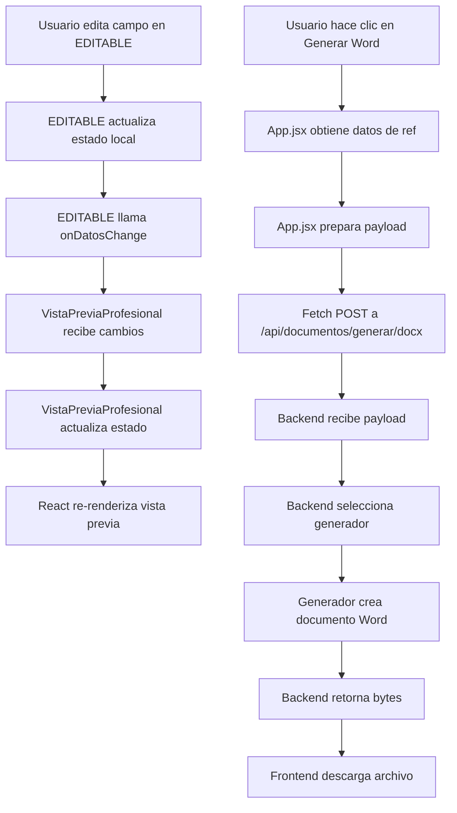

# 🏗️ ARQUITECTURA: Integración de Plantillas EDITABLE y Generación de Documentos

## 📋 PREGUNTA DEL USUARIO

> "¿En App.jsx está toda la lógica o estamos llamando a cada elemento al momento de generar? ¿Cuál es más conveniente? ¿Cómo se integran las plantillas EDITABLE al frontend y cómo se crean los Word y PDF?"

---

## 🎯 RESPUESTA PROFESIONAL

### Estado Actual vs. Arquitectura Ideal

#### ❌ PROBLEMA ACTUAL: App.jsx Sobrecargado

```
App.jsx (2066 líneas)
├── Estados globales (40+ estados)
├── Lógica de negocio
├── Manejo de PILI
├── Navegación entre pasos
├── Renderizado de componentes
├── Generación de documentos
└── Personalización
```

**Problemas**:
- 🔴 Demasiada responsabilidad en un solo archivo
- 🔴 Difícil de mantener
- 🔴 Difícil de testear
- 🔴 Acoplamiento alto

#### ✅ ARQUITECTURA IDEAL: Separación de Responsabilidades

```
Frontend
├── App.jsx (Orquestador - 500 líneas)
│   ├── Navegación entre pasos
│   ├── Estados globales mínimos
│   └── Composición de componentes
│
├── Componentes de UI
│   ├── PanelPILI.jsx
│   ├── PanelPersonalizacion.jsx
│   └── BotonesGeneracion.jsx
│
├── Componentes EDITABLE (Plantillas)
│   ├── EDITABLE_COTIZACION_COMPLEJA.jsx
│   ├── EDITABLE_COTIZACION_SIMPLE.jsx
│   ├── EDITABLE_PROYECTO_SIMPLE.jsx
│   ├── EDITABLE_PROYECTO_COMPLEJO.jsx
│   ├── EDITABLE_INFORME_TECNICO.jsx
│   └── EDITABLE_INFORME_EJECUTIVO.jsx
│
└── Servicios
    ├── DocumentService.js (Generación)
    └── PILIService.js (IA)
```

---

## 🔄 FLUJO COMPLETO: De React a Word/PDF

### Paso 1: Usuario Interactúa con EDITABLE

```javascript
// EDITABLE_COTIZACION_COMPLEJA.jsx
const EDITABLE_COTIZACION_COMPLEJA = ({ datos, onDatosChange, ... }) => {
    const [datosEditables, setDatosEditables] = useState(datos);
    
    // Usuario edita un campo
    const actualizarItem = (index, campo, valor) => {
        const nuevosItems = [...datosEditables.items];
        nuevosItems[index][campo] = valor;
        setDatosEditables({ ...datosEditables, items: nuevosItems });
        
        // ✅ Notificar al padre (VistaPreviaProfesional)
        onDatosChange({ ...datosEditables, items: nuevosItems });
    };
    
    return (
        <div>
            {/* Renderizado visual con estilos inline */}
            <table>
                <tbody>
                    {datosEditables.items.map((item, index) => (
                        <tr key={index}>
                            <td>
                                <input 
                                    value={item.descripcion}
                                    onChange={(e) => actualizarItem(index, 'descripcion', e.target.value)}
                                />
                            </td>
                        </tr>
                    ))}
                </tbody>
            </table>
        </div>
    );
};
```

### Paso 2: VistaPreviaProfesional Recibe Cambios

```javascript
// VistaPreviaProfesional.jsx
const VistaPreviaProfesional = forwardRef((props, ref) => {
    const [datosEditables, setDatosEditables] = useState(props.cotizacion);
    
    const handleDatosChange = (nuevosDatos) => {
        // ✅ Actualizar estado local
        setDatosEditables(nuevosDatos);
        
        // ✅ Vista previa se actualiza automáticamente (React re-render)
    };
    
    // ✅ Exponer datos al padre (App.jsx)
    useImperativeHandle(ref, () => ({
        getEditedData: () => datosEditables
    }));
    
    return (
        <EDITABLE_COTIZACION_COMPLEJA
            datos={datosEditables}
            onDatosChange={handleDatosChange}
            {...otrosProps}
        />
    );
});
```

### Paso 3: App.jsx Obtiene Datos y Genera Documento

```javascript
// App.jsx
const App = () => {
    const vistaPreviaRef = useRef(null);
    
    const handleDescargar = async (formato) => {
        // ✅ 1. Obtener datos editados de VistaPreviaProfesional
        const datosFinales = vistaPreviaRef.current?.getEditedData();
        
        // ✅ 2. Preparar payload para backend
        const payload = {
            tipo_documento: tipoFlujo, // 'cotizacion-compleja'
            datos: datosFinales,
            personalizacion: {
                esquema_colores: esquemaColores,
                fuente: fuenteDocumento,
                logo_base64: logoBase64,
                ocultar_igv: ocultarIGV,
                ocultar_precios_unitarios: ocultarPreciosUnitarios,
                ocultar_totales_por_item: ocultarTotalesPorItem
            }
        };
        
        // ✅ 3. Llamar al backend
        const response = await fetch(`/api/documentos/generar/${formato}`, {
            method: 'POST',
            headers: { 'Content-Type': 'application/json' },
            body: JSON.stringify(payload)
        });
        
        // ✅ 4. Descargar archivo
        const blob = await response.blob();
        const url = window.URL.createObjectURL(blob);
        const a = document.createElement('a');
        a.href = url;
        a.download = `cotizacion_${Date.now()}.${formato}`;
        a.click();
    };
    
    return (
        <div>
            <VistaPreviaProfesional
                ref={vistaPreviaRef}
                cotizacion={cotizacion}
                {...otrosProps}
            />
            <button onClick={() => handleDescargar('docx')}>
                Generar Word
            </button>
        </div>
    );
};
```

### Paso 4: Backend Genera Documento

```python
# backend/app/api/routes/documentos.py
@router.post("/generar/{formato}")
async def generar_documento(formato: str, payload: dict):
    """
    Genera documento Word o PDF
    """
    # ✅ 1. Extraer datos del payload
    tipo_documento = payload['tipo_documento']
    datos = payload['datos']
    personalizacion = payload['personalizacion']
    
    # ✅ 2. Seleccionar generador apropiado
    if tipo_documento == 'cotizacion-compleja':
        generador = CotizacionComplejaGenerator()
    elif tipo_documento == 'cotizacion-simple':
        generador = CotizacionSimpleGenerator()
    # ... otros tipos
    
    # ✅ 3. Generar documento Word
    doc = generador.generar(
        datos=datos,
        esquema_colores=personalizacion['esquema_colores'],
        logo_base64=personalizacion['logo_base64'],
        fuente=personalizacion['fuente'],
        ocultar_igv=personalizacion['ocultar_igv'],
        ocultar_precios_unitarios=personalizacion['ocultar_precios_unitarios'],
        ocultar_totales_por_item=personalizacion['ocultar_totales_por_item']
    )
    
    # ✅ 4. Convertir a PDF si es necesario
    if formato == 'pdf':
        pdf_bytes = convertir_word_a_pdf(doc)
        return Response(content=pdf_bytes, media_type='application/pdf')
    
    # ✅ 5. Retornar Word
    return Response(content=doc_bytes, media_type='application/vnd.openxmlformats-officedocument.wordprocessingml.document')
```

### Paso 5: Generador Python Crea Word

```python
# backend/app/services/generators/cotizacion_compleja_generator.py
class CotizacionComplejaGenerator(BaseGenerator):
    def generar(self, datos, **kwargs):
        """
        Genera documento Word usando python-docx
        """
        # ✅ 1. Crear documento
        doc = Document()
        
        # ✅ 2. Aplicar colores
        colores = self.get_colores(kwargs['esquema_colores'])
        
        # ✅ 3. Agregar logo
        if kwargs['logo_base64']:
            self.agregar_logo(doc, kwargs['logo_base64'])
        
        # ✅ 4. Agregar encabezado
        self.agregar_encabezado(doc, datos, colores)
        
        # ✅ 5. Agregar tabla de ítems
        self.agregar_tabla_items(
            doc, 
            datos['items'],
            ocultar_precios=kwargs['ocultar_precios_unitarios'],
            ocultar_totales=kwargs['ocultar_totales_por_item']
        )
        
        # ✅ 6. Agregar totales
        self.agregar_totales(
            doc,
            datos,
            ocultar_igv=kwargs['ocultar_igv']
        )
        
        # ✅ 7. Retornar bytes
        return self.doc_to_bytes(doc)
```

---

## 🎨 DIAGRAMA DE FLUJO COMPLETO



---

## 📊 COMPARACIÓN: Arquitecturas

### Opción A: Todo en App.jsx (Actual - NO RECOMENDADO)

```javascript
// App.jsx - 2066 líneas
const App = () => {
    // ❌ 40+ estados
    const [cotizacion, setCotizacion] = useState({});
    const [items, setItems] = useState([]);
    const [totales, setTotales] = useState({});
    // ... 37 estados más
    
    // ❌ Lógica de negocio mezclada
    const calcularTotales = () => { /* ... */ };
    const actualizarItem = () => { /* ... */ };
    const agregarItem = () => { /* ... */ };
    
    // ❌ Renderizado inline
    return (
        <div>
            <table>
                {/* 200 líneas de HTML inline */}
            </table>
        </div>
    );
};
```

**Problemas**:
- 🔴 Archivo gigante (2000+ líneas)
- 🔴 Difícil de entender
- 🔴 Imposible de testear unitariamente
- 🔴 Cambios en un lugar rompen todo

### Opción B: Componentes EDITABLE (Actual - RECOMENDADO)

```javascript
// App.jsx - 500 líneas (orquestador)
const App = () => {
    const vistaPreviaRef = useRef(null);
    
    return (
        <div>
            <VistaPreviaProfesional
                ref={vistaPreviaRef}
                cotizacion={cotizacion}
            />
        </div>
    );
};

// VistaPreviaProfesional.jsx - 130 líneas (contenedor)
const VistaPreviaProfesional = forwardRef((props, ref) => {
    return <EDITABLE_COTIZACION_COMPLEJA {...props} />;
});

// EDITABLE_COTIZACION_COMPLEJA.jsx - 340 líneas (plantilla)
const EDITABLE_COTIZACION_COMPLEJA = ({ datos, onDatosChange }) => {
    // ✅ Lógica específica de cotización compleja
    // ✅ Renderizado visual
    // ✅ Manejo de estado local
};
```

**Ventajas**:
- ✅ Separación de responsabilidades
- ✅ Fácil de mantener
- ✅ Testeable
- ✅ Reutilizable

---

## 🔑 PRINCIPIOS CLAVE

### 1. Separación de Responsabilidades

```
App.jsx
├── Responsabilidad: Orquestación
├── NO debe: Renderizar HTML inline
├── NO debe: Tener lógica de negocio específica
└── SÍ debe: Componer componentes

EDITABLE_*.jsx
├── Responsabilidad: Plantilla visual + lógica específica
├── SÍ debe: Renderizar HTML con estilos
├── SÍ debe: Manejar estado local
└── SÍ debe: Notificar cambios al padre

Generadores Python
├── Responsabilidad: Crear documentos Word/PDF
├── SÍ debe: Recibir datos del frontend
├── SÍ debe: Aplicar estilos y formato
└── SÍ debe: Retornar bytes del documento
```

### 2. Flujo Unidireccional de Datos

```
App.jsx (fuente de verdad)
    ↓ props
VistaPreviaProfesional (intermediario)
    ↓ props
EDITABLE (presentación)
    ↑ callbacks
VistaPreviaProfesional (actualiza estado)
    ↑ ref.getEditedData()
App.jsx (obtiene datos finales)
    ↓ HTTP POST
Backend (genera documento)
```

### 3. Componentes como Plantillas

Los componentes EDITABLE son **plantillas visuales** que:
- ✅ Definen la estructura del documento
- ✅ Aplican estilos inline (para fidelidad visual)
- ✅ Son editables en tiempo real
- ✅ Sirven de referencia para el backend

**NO** son:
- ❌ Generadores de documentos
- ❌ Servicios de negocio
- ❌ Manejadores de estado global

---

## 🎯 RECOMENDACIONES PROFESIONALES

### 1. Refactorizar App.jsx

```javascript
// ❌ ANTES: App.jsx con todo
const App = () => {
    // 2066 líneas de código
};

// ✅ DESPUÉS: App.jsx como orquestador
const App = () => {
    return (
        <Router>
            <Paso1Configuracion />
            <Paso2ChatYPreview />
            <Paso3Finalizacion />
        </Router>
    );
};
```

### 2. Crear Servicios Dedicados

```javascript
// services/DocumentService.js
export class DocumentService {
    static async generarWord(datos, personalizacion) {
        const response = await fetch('/api/documentos/generar/docx', {
            method: 'POST',
            body: JSON.stringify({ datos, personalizacion })
        });
        return response.blob();
    }
    
    static async generarPDF(datos, personalizacion) {
        // Similar
    }
}

// Uso en componente
import { DocumentService } from './services/DocumentService';

const handleGenerar = async () => {
    const blob = await DocumentService.generarWord(datos, personalizacion);
    descargarArchivo(blob, 'cotizacion.docx');
};
```

### 3. Mantener EDITABLE como Plantillas Puras

```javascript
// ✅ CORRECTO: EDITABLE solo renderiza y notifica
const EDITABLE_COTIZACION_COMPLEJA = ({ datos, onDatosChange, ...config }) => {
    const [local, setLocal] = useState(datos);
    
    const handleChange = (newData) => {
        setLocal(newData);
        onDatosChange(newData); // Notificar al padre
    };
    
    return <div>{/* Renderizado visual */}</div>;
};

// ❌ INCORRECTO: EDITABLE con lógica de generación
const EDITABLE_COTIZACION_COMPLEJA = ({ datos }) => {
    const generarWord = () => {
        // ❌ NO! Esto es responsabilidad del backend
    };
    
    return <div>{/* ... */}</div>;
};
```

---

## 📈 BENEFICIOS DE LA ARQUITECTURA ACTUAL

| Aspecto | Beneficio |
|---------|-----------|
| **Mantenibilidad** | Cada componente tiene una responsabilidad clara |
| **Testabilidad** | Componentes EDITABLE se pueden testear aisladamente |
| **Reutilización** | EDITABLE se usa en Paso 2 y Paso 3 |
| **Escalabilidad** | Fácil agregar nuevos tipos de documentos |
| **Fidelidad Visual** | Lo que ves en React = Lo que obtienes en Word/PDF |

---

## 🚀 PRÓXIMOS PASOS RECOMENDADOS

1. **Refactorizar App.jsx** (Reducir de 2066 a ~500 líneas)
   - Extraer Paso1, Paso2, Paso3 a componentes separados
   - Mover lógica de PILI a `PILIService.js`
   - Mover lógica de generación a `DocumentService.js`

2. **Completar Componentes EDITABLE**
   - Implementar los 5 componentes restantes
   - Asegurar consistencia de props
   - Agregar controles de visualización a todos

3. **Sincronizar Backend**
   - Asegurar que generadores Python respeten todos los flags
   - Implementar conversión Word → PDF
   - Agregar validación de datos

---

**Preparado por**: Antigravity AI  
**Fecha**: 2025-12-23  
**Tipo**: Documentación Arquitectónica  
**Estado**: ✅ **COMPLETO**
