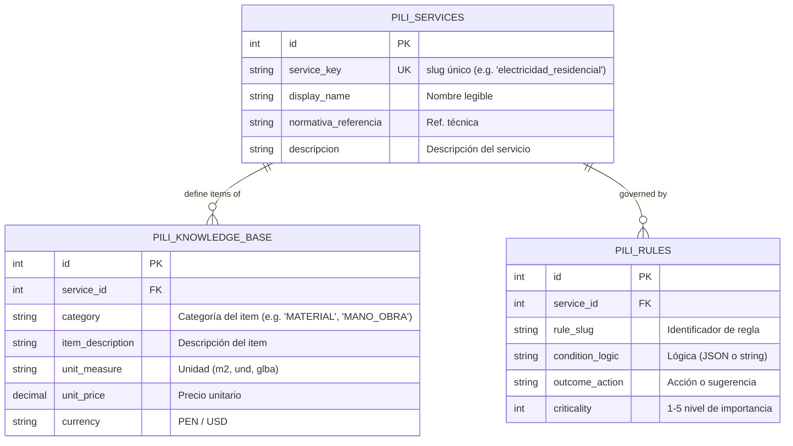

# Skill 03: Esquema de Base de Datos para Ingeniería de Conocimiento PILi

> **Objetivo:** Normalizar el conocimiento técnico de PILi en una base de datos relacional (SQLite), eliminando diccionarios hardcodeados.
> **Principio:** RAG (Retrieval-Augmented Generation) para reglas de negocio.

## Diagrama ER

## Definición de Tablas (DDL - SQLAlchemy)

La implementación física se realizará e `backend/modules/N02_Pili_Logic/knowledge_db.py`.

### 1. `pili_services`
Catálogo maestro de los 10 servicios especializados.

### 2. `pili_knowledge_base`
Lista de precios unitarios, materiales y costos asociados por servicio. Replaza a los diccionarios de precios actuales.

### 3. `pili_rules`
Reglas de inferencia técnica. Ejemplo: "Si es residencial y > 200m2, sugerir trifásico".
